class: middle left

#Assessment Coordinator Interview

##Jake Kaupp
##April 17th, 2015

---

class: middle center

##"describe an **efficient** and **reliable** process to do this, ..."

???
I propose a process that leverages distinct, yet complimentary assessment approaches.  At the heart of the process is engaging faculty and demonstrating how this approach can streamline assessment, reduce common assessment headaches and enhance student learning.

https://sites.google.com/site/uoftlearningoutcomesproject/

---

class: middle center

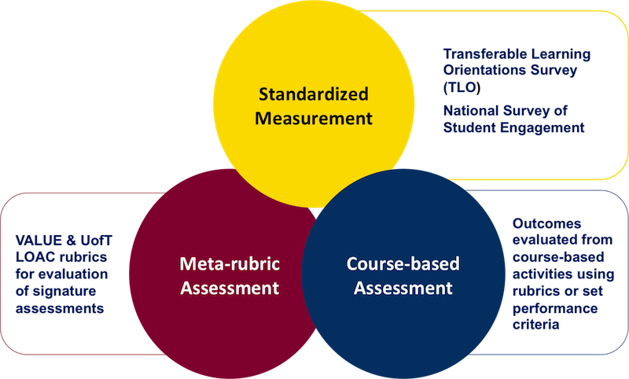

---

class: middle center

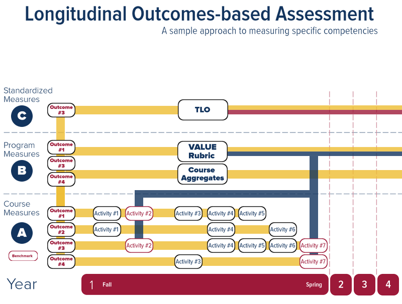

???
This approach would blend course-based assessment of learning outcomes with sampled programmatic assessment of learning outcomes using modified meta-rubrics (derived from the VALUE rubrics and exemplified by recent work coming from the University of Toronto's Learning Outcomes project)

It would also seek to use standardized approaches when necessary or available.  In this case, the TLO, a survey (in-development) to evaluate life long learning can be used to further triangulate data.

---

layout: false
.left-column[
  ### Program Evaluation
]
.right-column[

###With a committee of department representatives:

- Determine common aspects of the three graduate attributes are best represented and embodied by all 10 programs. 

- Determine unique aspects and how each program would develop and assess each attribute

- Develop shared and program-specific indicators for each attribute

	- Working to develop context and expectations for measurement at all four years 

	- Aligning with CEAB, Washington Accord, VALUE & UofT Rubrics
]
???
the programs can share common experiences and challenges, leverage and pool resources, and develop a community focused on assessment. 

---
.left-column[
  ### Program Evaluation
  ### Curriculum Mapping
]
.right-column[
###Using a collaborative mapping approach, map attributes and indicators:

- Connecting indicators to courses, course learning outcomes, assessments and learning experiences

- Review the maps, addressing gaps in development and alignment

- Identify key pathways for development

- Identify key courses for asessment

- Identify signature assessments for VALUE scoring
]
???
 Using the information from curriculum mapping, address any potential gaps in development or assessment, and suggest possible methods to address the gaps.  This would be best accomplished through consultation with faculty whose course provides the best vantage point for assessment.   I would also encourage checking progression and development of outcomes across the curriculum, and encourage departments to think about alignment between courses, outcomes and assessments.  Depending upon time constraints, the latter can be left for a future revision to the curriculum.

---

class: middle center

##"...including what **information** you would propose to gather, ..." 

---
.left-column[
  ### Program Evaluation
  ### Curriculum Mapping
  ### Assessment Strategy
]
.right-column[
With departmental reps, using curriculum information:

- Take stock of current assessment efforts in the program, the faculty and the institution

- Verify vital points for assessment in each year of the program

- Utilze a mixed methods approach, collecting both direct and indirect measures of student performance

- Review assessments for alignment, complexity & authenticity

- Ensure points for triangulation
]
???
Alongside the departmental representative, help to develop an assessment strategy to measure and assess each attribute across the four years of the program. I would begin by determining what assessments are already underway in the program, and what larger scale assessment information is being conducted by the faculty or institution (NSSE, CLASSE, Standardized testing, Other Initiatives)

I would seek to develop the process efficiently, by targeting courses that offer the best opportunity for students to demonstrate these abilities (cornerstone and capstone courses, design experiences, etc). 

Any strategy would include using direct and indirect assessment of indicators, drawing from course-based assessment results, surveys of student perceptions, student focus groups.  Many of the attributes lend themselves well to peer assessment, which can help allievate some of the workload from faculty

Any strategy developed would be designed to ensure multiple points of assessment for each indicator, and triangulating measures of learning (direct, indirect, standardized, etc).  

Depending upon levels of engagement and interest, additional strategies could be suggested such as portfolio implementation, meta-rubric assessment, or potential for learning analytics to harness transactional learning data as a supportive measure.

---

class: middle center

##"...**analysis** you would conduct, ..."

---

.left-column[
  ### Program Evaluation
  ### Curriculum Mapping
  ### Assessment Strategy
  ### Analysis
]
.right-column[
Analyses can be relatively simple or complex, depending upon need:

- Correlation between indicators and other assessments

- Factor analysis of indicators
 
- Cohort performance comparison between courses/assessments on common indicators

- Frequency tables & chi-sqaured analyses on rubric levels

- Program/stream performance comparison

- MANOVA: Longitudinal growth on indicators over time

- Discrete demographic based analysis

- Interrater reliability on assessments

- Psychometric measurement of validity and reliability
]
---

class: middle center

##"...and how you would propose to **work with departments..."** 

---

.left-column[
  ### Program Evaluation
  ### Curriculum Mapping
  ### Assessment Strategy
  ### Analysis
  ### Working with Faculty
]
.right-column[
Creating ownership by illustrating value, streamlining work, and building a community of practise

- Intensively work with department representatives to plan approaches

- Form partnerships with the CTL to provide faculty develompment 
 
- Work with departments to run workshops, collect feedback and work to improve processes

- Utilize technologies to streamline assessment workflows (Desire2Learn)

- Help faculty develop learning outcomes and adapt/develop assessments 

- Create documentation/reporting and data analysis for QUQAP and CEAB accreditation 
]

???
The hardest part is getting faculty to transition from their standard view of assessment and workflow towards an outcomes-based approach.  The typical manner may have worked for a time, but it really doesn't outline what students can actually do at the conclusion of a course or program.

A 75% might mean that the student is well-versed, but in specifically what?  Grades are agglomerations of many things, and it's time to unpack those into discrete skills.  It's not giving up grades entirely, as they still work for technical knowledge, but we need to first reliably and clearly assess the outcome first, then create the grade from that.

Rubric based evaluation can do this.  A well crafted rubric can reduce rater workload, reduce the amount of questions and arguing that usually accompanies grading, and they can easily and quickly be modified to changing context and assessments.

But the key is faculty buy-in, and to do that, you have to give them something.  Reduced workload, increased student achievement, reduced office hour visits, demonstrable contibutions to learning.  Essentially by investing in this, the payoff in the long run will be an assessment process that can be used for grading and quality assurance, without duplicating or doing a mad dash of extra work every 6-7 years.  

---

class: middle center

##"...to **improve the quality** of the **process** and our **programs.**"

---

.left-column[
  ### Program Quality
]
.right-column[
### Improving the **quality of the program** is tied to **student achievement**, but is now focused on **skills and abilities** students leave with, rather than grades.
]

???

- Clearly articulated learning outcomes are one of the top 3 effect sizes for increasing student achievement
- Starting with assessment we start to build reflective practise. 
- Is this the best way to assess our students?
- Is they achieving the outcomes? Is peformance acceptable?
- Can we develop these outcomes better?
- Is there a better way?
- It's about the continued committment to improving quality.

---

.left-column[
  ### Program Quality
  ### Process Quality
]
.right-column[
### In a continuous cycle, **enhancing process quality** means **streamlining** and **efficiency**, enhanced **reliability, accuracy and validity**, embracing **sustainability**, and being able **innovate and adapt** to the **changing demands** of teaching and learning in higher education.
]

---

class: middle center

#####?

---

class: middle center

#Portfolio of 
##Assessment Work

---

.left-column[
  ### HEQCO CT 
]
.right-column[
####Evaluating Critical Thinking and Problem Solving in Large Classes: Model Eliciting Activities for Critical Thinking Development

1. Standardized testing (CLA, CCTT:Z, ICT)

2. Course based outcomes using MEA

3. Academic Motivation Survey

4. Qualitative Performance Task Evaluations

####Pre-post mixed-methods study design over the duration of APSC 100: M1

]
???

- Working with IRP as part of another CLA project
- Extensive data collection, management & planning over a 4 month period
- Analysis of assessment data, investigating development and contrasting various approaches
- Mixed methods approach
- Triangulating standardized testing with course outcomes, survey data and qualitative think aloud problems
- Great deal of work with students to determine their take on intended development (think alouds, surveys, informal interviews, qualiative coding)

---

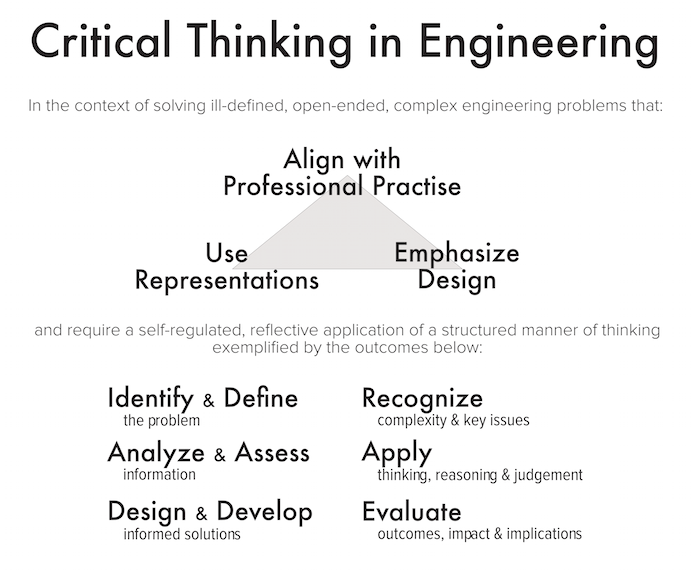

???
- Authentic, performance-based assessment that also incorporates many opportunities for graduate attribute assessment

---

.left-column[
  ### HEQCO CT 
  ### HEQCO LOAC
]
.right-column[
####Learning Outcomes Assessment Consortium: Assessing Transferrable Intellectual Skills Across a University

4 strand assessment approach:

1. Standardized Testing (CLA+, CAT, MSLQ)

2. Course-embedded measures 

3. Meta-rubric assessment

4. Qualitative Performance Task Evaluations

Following a cohort of students from entry to graduation in 4 different programs:
####Drama, Psychology, Physics & Engineering
]

---

class: middle center

###Extensive work with faculty, to develop assessment approaches for course-embedded outcomes measurement.

###Sharing the data from the project with instructors has yielded enormous buy-in and momentum

---

class: middle center

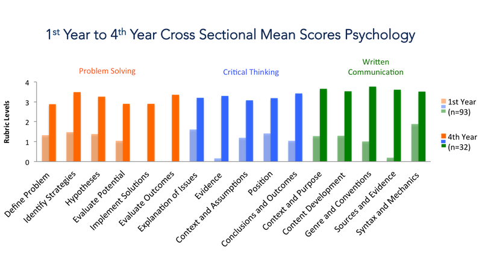

---

class: middle center

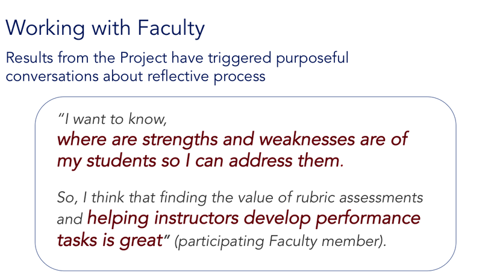

---

.left-column[
  ### HEQCO CT 
  ### HEQCO LOAC
  ### TLO
]
.right-column[
####Transferrable Learning Outcomes Survey

Instrument to assess aspects of life-long learning, developed as part of the HEQCO LOAC Project

* 6 constructs: 
	1. Outome Motivation 
	2. Learning Belief 
	3. Self-efficacy 
	4. Transfer 
	5. Organization
	6. Self-regulation
	
* Internally triangulated measurement
	* 4 Scale items 
	* 1 Self assessment adapted from the lifelong learning VALUE rubric
	* 1 Open-ended response addressing the construct theme
]

---

class: middle center

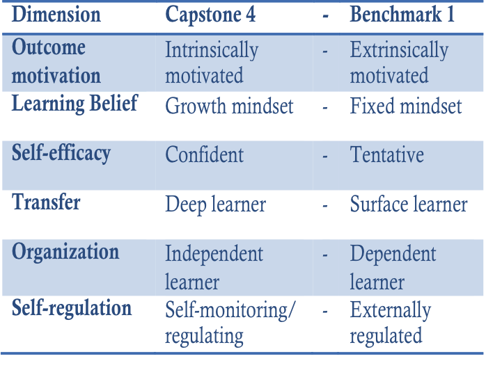

---

class: middle center

###The TLO has been **collaboratively developed** with **students**, and has roots as a **formative tool** for student improvement.  As such, a **visualization framework** is in development to provide **immediate feedback** to the student about their results.

---
class: middle center

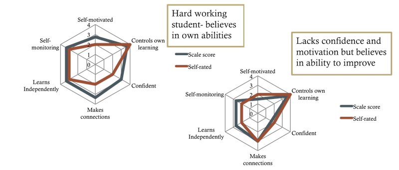

---

.left-column[
  ### HEQCO CT 
  ### HEQCO LOAC
  ### TLO
  ### EGAD
]
.right-column[
####Engineering Graduate Attribute Development (EGAD) Project

Founded by the National Council of Deans of Engineering and Applied Science
* Delivers resources, training and support for outcomes-based assessment and data-informed continuous improvement

* Serve as the point of contact and work with the engineering community to help with challenges, issues and offer support. 

* Provide reviews of technology to support assesment and improvement

* Promotes an approach to accreditation rooted in effective practise, faculty ownership and a scholarly approach.

####Recently focused on visualization of curriculum mapping & assessment data for reporting

]

---

class: middle center

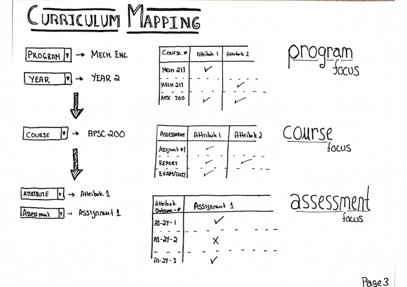

---

class: middle center

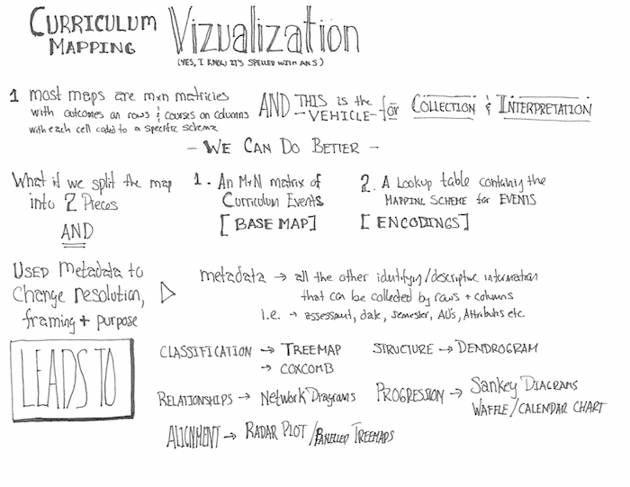

---

class: middle center

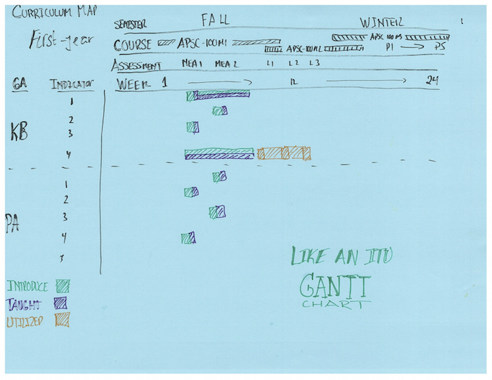

---

class: middle center

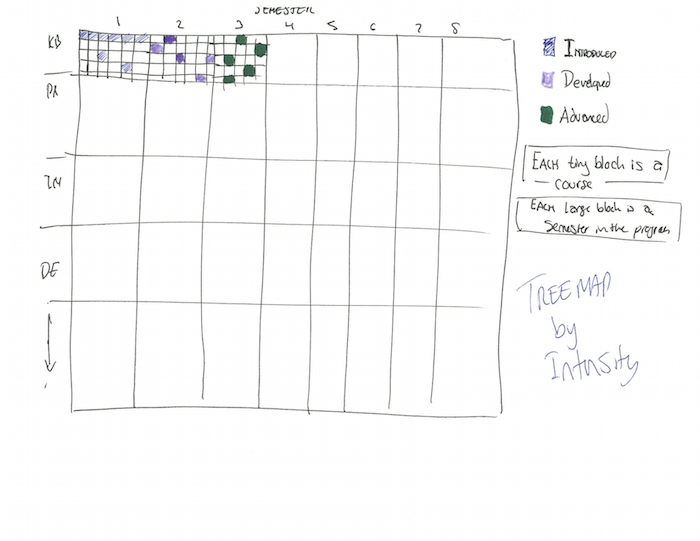

---

class: middle center

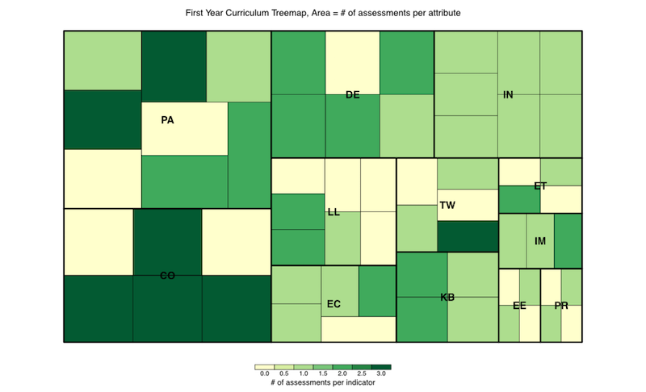

---

class: middle center

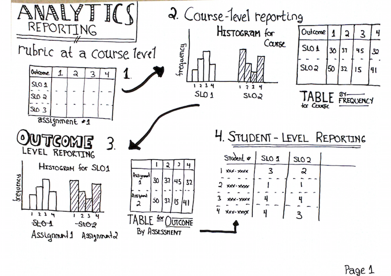

---

class: middle center

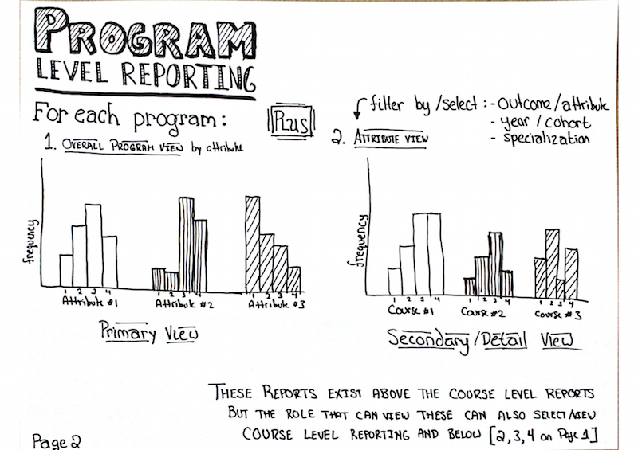

---

class: middle center

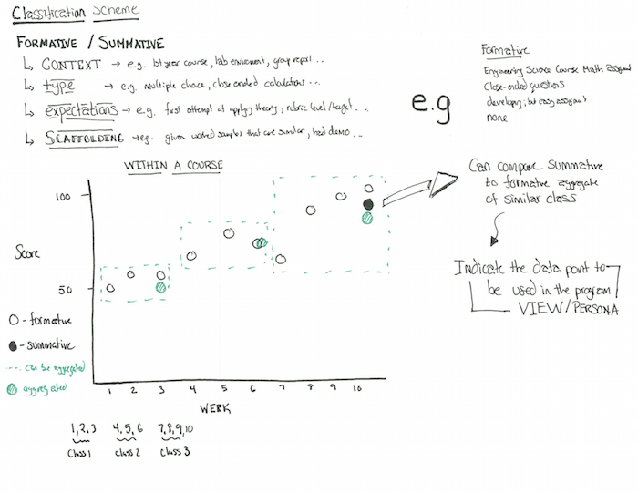

---

class: middle center

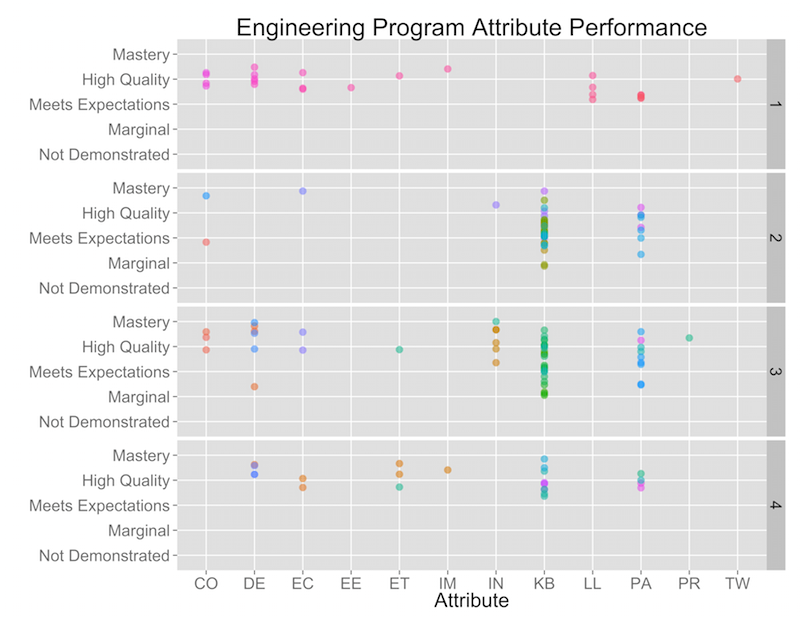

---

class: middle center

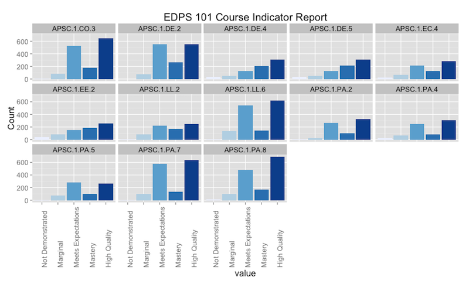

---

class: middle center

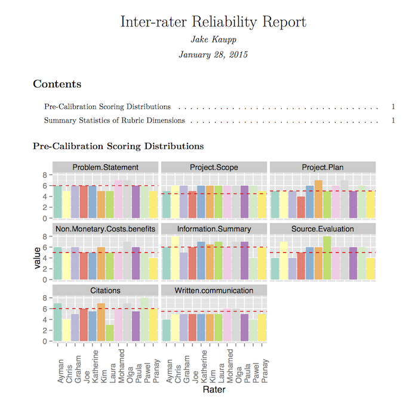

---

class: middle center

#Thank you.

